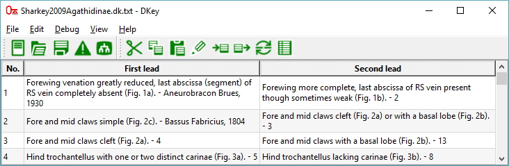
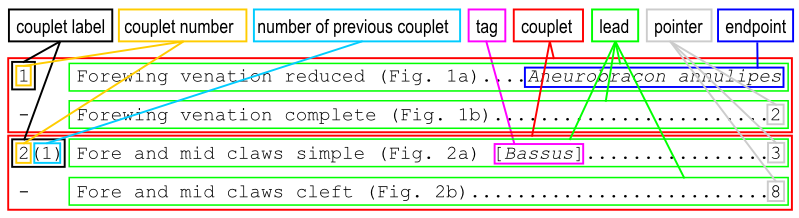

<!-- README.md is generated from README.Rmd. Please edit that file -->

# DKey 

<!-- badges: start -->
<!-- badges: end -->

DKey software is an editor of dichotomous taxonomic keys. It can be used
by taxonomic experts to create keys or by users of printed keys to make
them more user friendly. DKey is a free alternative to [Lucid
Phoenix](http://www.lucidcentral.org/lucid-phoenix/).

## Main features of DKey

- importing existing keys in text format

- combining keys

- moving couplets

- copying couplets

- removing couplets

- renumbering couplets

- making taxonomic keys user friendly

## Installation

No installation is required just download binaries and unpack them:

1.  Download the ZIP file:
    [DKey-windows-binaries.zip](https://github.com/DrawWing/DKey/blob/master/bin/DKey-windows-binaries.zip)

2.  Unpack the ZIP file and copy DKey directory to your hard drive.

3.  Run the DKey.exe

## User interface

The key is displayed in a table with couplets represented by rows. There
are three columns: the first column displays couplet number, the second
column displays first lead and the third column displays the second
lead. The table can be used to edit key by inserting, removing, copying
and moving couplets. Content of the couplet can also be changed using
Edit couplet.

## Dichotomous taxonomic key

Dichotomous taxonomic key consists of a series of consecutively numbered
couplets. Each couplet consist of two parts called leads. At the end of
each lead there is a reference, which can be either a number pointing to
other couplet or a text indicating a name of a species or other
taxonomic group. The two types of reference are called here “pointer”
and “endpoint”, respectively. Pointers are numbers indicating the next
couplet and endpoints are taxonomic names obtained at the end of
identification process. In front of each couplet there is a couplet
label consisting of couplet number followed by number of the previous
couplet in parentheses. The couplet number uniquely identifies couplet
and it can be used as its address. In a dichotomous key all couplets,
except the first, should be addressed by at least one pointer in other
couplet, which is indicated by the “number of the previous couplet”.

## Image integration

If you want to display images in the key browser ensure that in the key
text there is keyword “Fig.” before each figure name. Moreover, in the
same directory as the .dk.xml file (containing the key) for each image
name there need to be an image with the same file name but pre-appended
with “fig-”. For example, if in a couplet there is text “(Fig. 1a, 1b)”,
in the same directory there should be two image files: “fig-1a.png” and
“fig-1b.png”. Apart from providing the image with appropriate image
name, the user does not need to make any action to make the images
visible in the key browser. At the moment there are supported two image
file extensions “.png” and “.jpg”.

## Citation

If you find this software useful please cite it:

Tofilski A (2018) DKey software for editing and browsing dichotomous
keys. ZooKeys 735: 131-140. <https://doi.org/10.3897/zookeys.735.21412>
